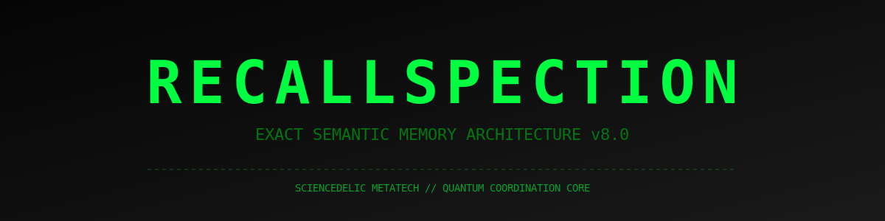
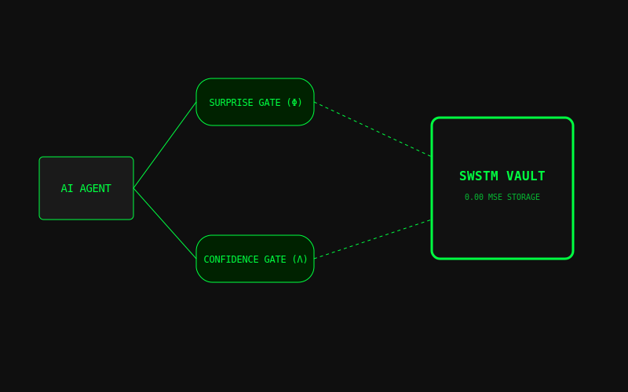

<p align="center">
  
  
  
  
</p>

## 🔮 The v8 Architecture
Recallspection is the first production-ready memory architecture that eliminates hallucinations through exact semantic transitions.

### System Overview
<p align="center">
  
</p>

### 🔧 Core Specifications
- **SWSTM Vault**: Immutable, append-only bit-perfect retrieval.
- **Surprise Gating**: Dynamic thresholding (Φ) to prevent memory saturation.
- **Confidence Sentinel**: Returns `None` (⊥) instead of hallucinating when similarity < 0.95.

## 🚀 Quick Start
```python
from recallspection.core.memory import SemanticMemory
memory = SemanticMemory(dim=384)
memory.add("Quantum State A", "Result 0x4F")
```
