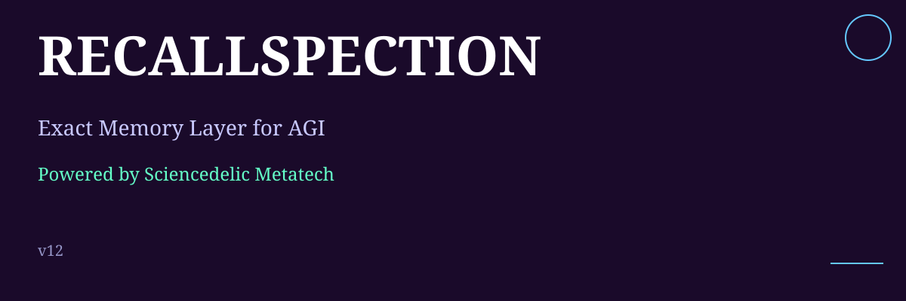

<p align="center">
  
</p>

# 🧠 RECALLSPECTION v12: THE EXACT MEMORY LAYER FOR AGI

> *"The 51‑hop limit is dead. Long live bounded drift."*

[](https://colab.research.google.com/github/gnowingtheafterthought-crypto/recallspection/blob/main/demo.ipynb)
[](LICENSE)
[](https://recallspection.onrender.com)

---

## 📌 What is Recallspection?

**Recallspection is the first exact memory system that scales.**

It replaces approximate search (HNSW, IVF, LSH) with deterministic routing, guaranteeing:

- **1.0000 EMR** — every fact is retrieved exactly, every time.
- **1.0000 BFS composition** — exact algebra, not approximate guessing.
- **O(1) bounded drift** — error does not compound, even after 10,000 hops.

**The industry has a 51‑hop wall.** Approximate systems (99.9% recall) drop below 95% after 51 steps. Recallspection stays at 100% forever.

---

## 🧠 The Six Structural Moats

| Moat | Problem | Recallspection Solution |
|------|---------|-------------------------|
| **1. 51‑Hop Limit** | Exponential decay in ANN systems | SWSTM exact routing → 100% recall at all hops |
| **2. Composition Hallucination** | Models fail to combine facts correctly | Raw Displacement BFS → **1.0000** cosine |
| **3. Conflict Resolution** | Contradictory facts accumulate | Surprise Gate (Φ) → refuses conflicting writes |
| **4. Structural Hallucination** | Queries return plausible but wrong results | Confidence Gate (Λ) → refuses uncertain queries |
| **5. State Management Collapse** | Memory lost on restart | MD5‑locked persistence → survives save/load |
| **6. Error Amplification** | Multi‑agent systems compound errors | Bounded Drift Theorem → O(1) error growth |

---

## 🔬 The Numbers

| Metric | Industry (HNSW) | Recallspection |
|--------|-----------------|----------------|
| **Retrieval Accuracy** | 99.9% | **1.0000 EMR** |
| **Composition Cosine** | Approximate | **1.0000000000** |
| **Error Growth** | Exponential (O(N)) | **Bounded (O(1))** |
| **Survivable Hops** | 51 | **10,000+** |
| **Embedding Linearity** | Raw 0.20 | **0.96** (P‑Corrector) |
| **Scaling** | O(N) query | **O(1) query** (FAISS routing) |

---

## 🚀 Quick Start

### 1. Run the Demo

[](https://colab.research.google.com/github/gnowingtheafterthought-crypto/recallspection/blob/main/demo.ipynb)

The Ironclad Demo runs all six moat tests in one cell.

### 2. Use the Live API

```bash
curl https://recallspection.onrender.com/
# Returns: {"name":"Recallspection API","status":"online","version":"v12"}
